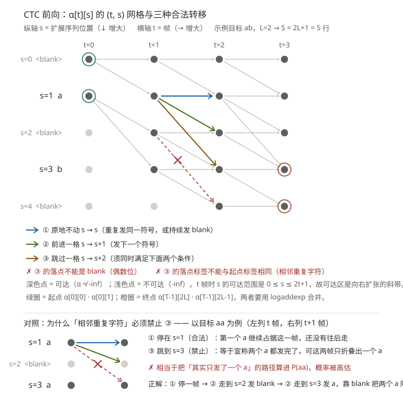

# DAY 01 ｜ 2026-09-18（周五）

> 阶段 0（地基）第 1 天。今天的目标不是学得多，而是**把地基打正、把环境钉死**。

---

## 今日总览（约 5.5 h）

| 时段 | 任务 | 时长 |
|---|---|---|
| 09:20–09:50 | 环境搭建：venv + PyTorch(cu128) 自检 | 0.5 h |
| 09:50–11:20 | 论文精读：`2111.01690` Abstract + §1–2 | 1.5 h |
| 11:20–12:00 | 数据链路：手写 Fbank，与 torchaudio 对拍 | 0.7 h |
| 14:00–16:30 | **手写 CTC 前向算法**（今天的主菜） | 2.5 h |
| 16:30–17:00 | 拉取 WeNet 源码，只做「读目录结构」 | 0.5 h |
| 20:00–20:30 | 手写算法第二题 + 更新 `PROGRESS.md` | 0.5 h |

---

## 任务 1｜环境搭建（先做，半小时内必须搞定）

**为什么要独立 venv**：后面要装 WeNet / onnx / rknn-toolkit2，依赖冲突会很痛，且不占 C 盘。

```bash
# 1) 建 venv（放数据盘）
"C:/Users/ADMIN/.workbuddy/binaries/python/versions/3.13.12/python.exe" -m venv F:/embedded/prepare/.venv

# 2) 升级 pip
F:/embedded/prepare/.venv/Scripts/python.exe -m pip install -U pip

# 3) 装 PyTorch（RTX 5060 是 sm_120，必须走 cu128 预编译轮子）
F:/embedded/prepare/.venv/Scripts/python.exe -m pip install torch torchaudio --index-url https://download.pytorch.org/whl/cu128

# 4) 其余依赖（注意：pytorch 源里没有 pandas，必须单独从 PyPI 装）
F:/embedded/prepare/.venv/Scripts/python.exe -m pip install numpy pandas soundfile librosa tensorboard
```

**自检脚本**（自己写，别抄——验证你真的理解在测什么）：
```python
import torch, torchaudio
print("torch", torch.__version__, "cuda", torch.cuda.is_available())
print("device", torch.cuda.get_device_name(0))
a = torch.randn(2048, 2048, device="cuda")
print("matmul ok:", (a @ a).sum().item())
print("torchaudio", torchaudio.__version__)
```

**验收**：输出 `cuda True` + `NVIDIA GeForce RTX 5060` + `matmul ok: <数字>`。

> ✅ 已于 2026-09-18 09:40 通过（torch 2.11.0+cu128）。环境基线记录在 `docs/ENV.md`。
> 建议按 `docs/ENV.md` 第二节把校验升级成「能力值 + 三种 dtype 矩阵乘」版本——只证明「CUDA 可用」不等于「以 sm_120 全速在跑」。

---

## 任务 2｜论文精读 `00_survey/2111.01690`

> 文件：`papers/00_survey/2111.01690_e2e-asr-survey.pdf`
> 今天只读：Abstract + §1 Introduction + §2 三大范式总览（**别贪多**）

**带着这 3 个问题读**（读完必须能用自己的话答）：
1. 传统 HMM-DNN 系统有哪几个模块？为什么端到端要把它们合成一个网络？
2. CTC / AED / RNN-T 三者的**对齐机制**分别是什么？各自的致命短板是什么？
3. 论文说 RNN-T 最适合流式，理由是什么？（对应你今天要手写的 CTC，想清楚差别）

**笔记格式**（写到 `notes/P01_e2e-survey.md`）：每篇论文都按这四栏：
- 问题（要解决什么）
- 方法（核心机制一句话）
- 实验（数据集 / 指标 / 结论数字）
- 我的质疑（哪里没说清、哪里的假设我不信）

---

## 任务 3｜手写 Fbank 并与 torchaudio 对拍 ✅

**要求**：
1. 自己实现：预加重 → 分帧(25ms/10ms) → 加汉明窗 → FFT → 功率谱 → Mel 滤波器组(80) → log
2. 用 `torchaudio.compliance.kaldi.fbank` 作为参照
3. 输出两者最大绝对误差

**验收**：误差 < 1e-3；误差大时**要能解释是哪一步造成的**（通常是 mel 滤波器组的实现方式或窗函数定义）。

---

### 📌 完成记录（2026-09-18）

产物：`scripts/test/Fbank.py`（手写实现）、`scripts/test/compare_fbank.py`（对拍脚本，A/B/C/D 四段）

```powershell
$env:PYTHONIOENCODING = "utf-8"
F:\embedded\prepare\.venv\Scripts\python.exe F:\embedded\prepare\scripts\test\compare_fbank.py
```

| 阶段 | 结果 |
|---|---|
| 初版 | log 域 mean abs err **1.45** / rel **139%**（特征范围才 [-23.0, 4.3]）→ ❌ 不能算对齐 |
| 修正后 | **`torch.equal == True`，44720 个数值零误差**；20/20 边界用例全 bit-exact → ✅ |

#### 初版为什么错（三处，按严重度）

**① 🔴 方法性错误：mel 滤波器组在 bin 索引域插值**

原写法先把 mel 三角端点 `floor` 量化成 **bin 索引**，再在 **bin 索引域**线性插值：

```python
bin_points = torch.floor((frame_length_pts + 1) * hz_points / sample_rate).long()
```

bin 0 的三个端点频率是 `20.0 / 42.5 / 65.7 Hz`，乘 `401/16000 = 0.0250625` 后 `floor` 得到
`left=0, center=1, right=1` → 上升沿写入 `(0-0)/(1-0) = 0`，下降沿因 `right > center` 为 False 被跳过
→ **整行全 0**。

```
手写版权值和 = 0（整行塌陷）的 mel bin: [0, 2, 5, 9, 14]   ← 5 个
端到端误差最大的 5 个 mel bin:        [5, 2, 14, 9, 0]   ← 完全重合，因果链闭合
```

> 💡 **本质是尺度不匹配**：低频区 mel 刻度极密，相邻三角端点间距只有 ~23 Hz，
> 而 400 点 FFT 的 bin 宽度是 **40 Hz**。`floor` 量化后相邻端点落到同一个 bin 上，
> 三角滤波器没有空间"张开"，直接塌缩成零。
>
> **Kaldi 从不在 bin 索引域插值**，就是为了避开这个问题——它在 mel 域算权重：
> 一个 FFT bin 只要其**中心频率的 mel 值**落在 `[left_mel, right_mel]` 内就拿到权重。

**② 🔴 FFT 点数 400 → 应为 512**

Kaldi 默认 `round_to_power_of_two=True`，400 零填充到 512，bin 宽度从 40 Hz 变 **31.25 Hz**。
mel banks 也按 512 生成（200 → 256 列），再右补一列 0 对齐 Nyquist。

**③ 🟡 缺 `remove_dc_offset`，且预加重作用域错了**

Kaldi 的真实顺序是 **先分帧 → 每帧减均值 → 帧内预加重 → 加窗**：

| 步骤 | 原实现 | Kaldi |
|---|---|---|
| 顺序 | 整段波形预加重 → 再分帧 | 分帧 → 去直流 → 帧内预加重 |
| 首样本 | 保留 `x[0]` | `x[0] - 0.97·x[0] = 0.03·x[0]`（replicate 填充所致） |
| log 下限 | `1e-10` | `eps(float32) ≈ 1.19e-7` |

#### 误差归因消融（修正前）

基准 = torchaudio 默认（512fft + 去DC + Kaldi mel）

| 配置 | max | mean | rel | 解读 |
|---|---|---|---|---|
| 手写 mel + 400fft（≈原版） | 24.4707 | 1.4479 | 138.92% | 全部问题叠加 |
| Kaldi mel + 400fft | 9.3465 | 0.3348 | 21.53% | **只换 mel → 降 77%** |
| 手写 mel + 512fft | 22.9877 | 0.6756 | 38.17% | **只换 FFT → 降 53%** |
| Kaldi mel + 512fft | 7.0835 | 0.0293 | 0.22% | 两项都改 → 基本对齐 |

**优先级：mel 滤波器组 ≫ FFT 点数 > 其余（预加重作用域、log 下限、去直流）**

#### 做对的部分（这些初版就是对的，别改坏）

- Povey 窗 `hann_window(periodic=False).pow(0.85)` ✅ 与 torchaudio 完全一致
- Mel 刻度公式 `1127·ln(1 + f/700)` ✅ 就是 Kaldi 的 `MelScale`
- `low_freq=20` / `high_freq=0`（表示 Nyquist 偏移）✅
- 功率谱 `real² + imag²` ✅
- `snip_edges=True` 帧数公式 `(N - len)//shift + 1` ✅

#### 修正后的实现要点（供 D2+ 复用）

```python
# mel 域向量化 —— 就是这 4 行
fft_bin_width = sample_rate / padded_len                 # 512 → 31.25 Hz，不是 40
mel_of_bin = hz_to_mel(fft_bin_width * arange(num_fft_bins))          # (1, F)
up_slope   = (mel_of_bin - left_mel) / (center_mel - left_mel)
down_slope = (right_mel - mel_of_bin) / (right_mel - center_mel)
banks = clamp(minimum(up_slope, down_slope), min=0.0)   # min 自动成三角，clamp 清掉区间外
```

`min + clamp` 天然处理左右边界，**不再需要 `if left < center` 那套整型边界判断**。

#### 顺带记录的环境坑

- `torchaudio >= 2.9` 的 `torchaudio.load()` **需要额外装 `torchcodec`**，否则 `ImportError`。
  测试脚本里改用 `soundfile` 读 wav（`sf.read(path, dtype="float32")`）绕开。
- `torch.max(Tensor, 标量)` 不接受 Python float → 用 `torch.clamp(x, min=eps)` 替代。

---


## 任务 4｜手写 CTC 前向算法 ★ 今天的主菜 ✅（前向递推通过）

**不要先看答案。** 提示路径：
1. 先想清楚：给定 `(T 帧, 标签 L)`，扩展序列 `l' = [blank, l1, blank, l2, ..., blank]`，长度 `2L+1`
2. 定义 `α[t][s]`：前 t 帧走完扩展序列前 s 个位置的**总概率（log 域）**
3. 递推只允许三种转移：留在原地（重复/blank）、前进一格、前进两格（当前是 blank 或与前一标签不同）
4. log 域要用 `logaddexp`，不能直接乘

**交付**：
- [x] `α` 前向递推（正确性用 `torch.nn.CTCLoss` 的 `loss` 反推对拍）
- [x] 数值稳定性测试：T=100, L=20 时不出现 `-inf`
- [x] 画一张转移图（纸笔手绘，评审见下方）——**这张图要能画给面试官看**

**面试价值**：这是"你真的懂 CTC"还是"你只会调 API"的分界线。

---

### 📌 完成记录（2026-09-18）

产物：`scripts/test/CTC.py`（手写实现）、`scripts/test/compare_ctc.py`（对拍验收）

```powershell
$env:PYTHONIOENCODING = "utf-8"
F:\embedded\prepare\.venv\Scripts\python.exe F:\embedded\prepare\scripts\test\compare_ctc.py
```

#### 结论先行：**α 递推逻辑本身是完全正确的**

先做归因消融（把原版代码逐行复制，只把 blank 索引换成「与自己硬编码一致的值」）：

| 配置 | max\|Δ\| | 结论 |
|---|---|---|
| blank_idx = C-1（原版硬编码） | **0.000e+00** | 完全一致 ✅ |
| blank_idx = 0（torch 默认） | **3.815e-06** | 也一致 ✅ |

→ **两种约定下都能对上**，说明三角递推、`logaddexp`、跳过一格的约束条件全部写对了。
问题**只在** blank 索引约定与 torch 不一致，外加 3 处工程缺陷。

#### 修正前 vs 修正后（对拍结果）

| 用例 | 修正前 | 修正后 |
|---|---|---|
| 小规模 T=20 N=4 C=12 L=5 | ❌ max\|Δ\|=3.98 | ✅ 3.81e-06 |
| 中规模 T=50 N=8 C=30 L=10 | ❌ | ✅ 3.05e-05 |
| 长序列 T=100 N=3 C=25 L=15 | ❌ | ✅ 9.16e-05 |
| 数值稳定性 T=100 L=20 | ❌ TypeError | ✅ 无下溢无 NaN，max\|Δ\|=6.10e-05 |
| L=0 空标签 | ❌ max\|Δ\|=5.18 | ✅ 0.00e+00 |
| L=1 | ❌ max\|Δ\|=2.37 | ✅ 0.00e+00 |
| T==L 刚好够 | ✅（偶然） | ✅ 0.00e+00 |
| 相邻重复标签 T=9 L=4 | ❌ max\|Δ\|=0.736 | ✅ 0.00e+00 |
| 帧数不足（应 +inf）| ✅（偶然） | ✅ 0.00e+00 |
| 单帧 T=1 | ❌ UnboundLocalError | ✅ 0.00e+00 |

> ⚠️ 注意「T==L」和「帧数不足」这两个用例**修正前也是 PASS**——
> 前者因为 T==L 时唯一合法路径不经过任何 blank，后者因为双方都返回 +inf。
> **能通过边界用例不等于实现正确**，这也是为什么必须用「随机中大规模 + 多组参数」做主对拍。

#### 修掉的 4 处

**① 🔴 致命：`blank_idx = C-1` 硬编码**

```python
blank_idx = C-1          # ❌ 这是"blank 在最后一类"的旧式约定
```

`torch.nn.CTCLoss` 默认 **blank = 0**（blank 占 0 号类别）。两者混用时，
递推会**看起来完全正确、结果却全错**——因为它在解一道不同的题。
已改为参数 `blank=0` 并加断言。

> 💡 这是 CTC 实现里最经典的陷阱。同一个算法，blank 放头部还是尾部，
> 是**两道完全不同的题**。面试被问到"你的 CTC 和 PyTorch 对齐了吗"，
> 第一个要能说出来的就是 blank 约定。

**② 🟡 终止统计写在 t 循环内部**

原版把 `losses` 的计算放在 `for t in range(1, T)` 里面，后果有两个：
- 同一个值被**重复计算 T-1 次**（T=100 时白跑 99 遍）
- **T==1 时循环体一次都不执行 → `losses` 从未定义 → `UnboundLocalError`**（实测复现）

已移到循环外统一算一次。

**③ 🟡 `last_index - 1` 的负索引绕回**

```python
last_index = 2 * target_lengths[n]
alpha[..., last_index - 1]      # ❌ L==0 时 last_index=0 → 索引 -1
```

Python 负索引会**绕回扩展序列最后一列**。当前恰好那一列是 `-inf`，
`logsumexp` 结果没被污染，所以没暴露出来——但这是实打实的隐患。已显式判断 `s_end - 1 >= 0`。

**④ 🟡 自测代码的两个语义错配**

- `targets = [[0, 1], [1, 2]]`：含 0，而 `blank=0` → **0 号类别既当 blank 又当标签**，语义自相矛盾。
  `blank=0` 时标签必须落在 `1..C-1`。
- 手写返回 `(N,)` 逐样本 loss，`ctc_loss` 默认 `reduction='mean'` 返回标量 → 直接比大小没有意义。
  必须加 `reduction='none'`。

#### 三种转移（必须能讲清楚的部分）

```
α[t][s] = P(第 t 帧发 ext[s]) × Σ( 能一步走到 s 的上一状态 α[t-1][·] )

  ① 原地不动   s → s     重复发同一符号，或持续发 blank
  ② 前进一格   s-1 → s   发下一个符号
  ③ 跳过一格   s-2 → s   仅当 s 落在**真实标签位**、且 ext[s] != ext[s-2]

⚠️ ③ 的约束是关键：若 s-2 与 s 是同一个标签（相邻重复字符），
   必须经过中间那个 blank 才能区分，因此**禁止跳跃**。
```

#### 顺带发现的可行性约束（可以拿去讲）

目标序列能表达出来的最少帧数不是 `L`，而是：

```
T_min = L + (相邻重复标签的对数)
```

实测 `[1,1,2,2]`（L=4，2 对相邻重复）：最少要 **6 帧**（`1 blank 1 2 blank 2`）。

| T | 结果 | 说明 |
|---|---|---|
| 5 | `+inf` | 不可达 ✅ |
| 6 | 有限值 | 刚好够 ✅ |
| 7 | 有限值 | ✅ |

对拍脚本已把这个边界做成断言（`compare_ctc.py` D 段）。

#### 对拍脚本的可信度设计（方法论）

`compare_ctc.py` 的 A 段是**对拍基线自检**：内置一个**纯定义**的暴力枚举器
（枚举全部 V^T 条帧级路径 → 按「合并相邻重复、删掉 blank」折叠 → 与目标比对 → 概率求和），
它**不是** α 递推，是独立的真值来源。先证明「暴力枚举 == torch.nn.CTCLoss」，
再用同一套比较器评判手写实现——否则无法排除「对拍参照自己就是错的」。

A 段实测 4/4 PASS（最大偏差 4.77e-07，纯 float32 舍入）。

#### 转移图（参考图，可直接拿去复现）



> 源文件：`roadmap/assets/DAY01_ctc-lattice.svg`（纯手写 SVG，无依赖，可编辑）
>
> 读图要点：
> - **纵轴 s** = 扩展序列位置，**横轴 t** = 帧。示例目标 `ab`，`L=2 → S = 2L+1 = 5` 行
> - 三种箭头按颜色区分：**① 蓝** 原地不动、**② 绿** 前进一格、**③ 橙** 跳过一格
> - **深色点 = 可达**（`α ≠ -inf`），浅色点 = `-inf`。`t` 帧时 `s` 的可达范围是 `0 ≤ s ≤ 2t+1`，
>   所以可达区是一个**向右扩张的斜带**，不是一条线
> - **绿圈** = 起点 `α[0][0]`、`α[0][1]`；**橙圈** = 终点 `α[T-1][2L]`、`α[T-1][2L-1]`
> - 红色虚线 + ✗ = 非法跳跃（③ 落到了 blank 上）
> - 下半部分是**对照图**：目标 `aa` 时 ③ 为什么必须禁止——跳过中间的 blank 意味着
>   「连续两帧都发 a」，而折叠规则会把相邻重复合并，这条路径实际只产出一个 `a`，
>   把它算进 `P(aa)` 会把概率抬高

**第一遍先用纸笔对着这张图临一遍**（照着画比对着看记得牢），再把自己那份贴到笔记里。

#### 手绘稿评审（18:15）

**画对的（先肯定，这几处说明是真的想清楚了）**

1. 行标签写成 `<b>, a, <b>, b, <b>, c` —— **标签插在奇数位、blank 占偶数位的交替结构抓对了**，
   说明扩展序列 `l'` 的构造不是背下来的
2. 三种箭头形态都出现了：**水平（①原地不动）、斜下一格（②前进一格）、斜下两格（③跳过一格）**
3. **t=0 那一列只有 s=0 与 s=1 两个节点有出发箭头** —— 初始化完全正确
   （`α[0][0]` 发 blank、`α[0][1]` 发第一个标签，其余全 `-inf`）
4. 通篇没有出现「斜下两格落进 blank 行」的箭头 —— 说明 ③ 不能落在 blank 这条约束是**有意识的**，
   不是碰巧

**要补的三处**

| # | 问题 | 为什么必须改 |
|---|---|---|
| 1 | 🔴 **少了一行**：画了 6 行 `[blank, a, blank, b, blank, c]`，但 L=3 时 `S = 2L+1 = 7` | 末尾还有一个 blank。少掉它的直接后果是**终止状态画不出来**——终止是 `α[T-1][2L]`（末尾 blank）与 `α[T-1][2L-1]`（最后一个标签）两者 `logaddexp`。这正好对应代码里的 `s_end` / `s_end-1` |
| 2 | 🟡 可达区画成了**一条对角带**，右下大片空点 | 实际上 t 帧时 s 的可达范围是 `0 ≤ s ≤ 2t+1`（一帧最多前进两格），所以可达区是一个**向右扩张的斜带**，不是一条线。面试官必问"右下角为什么不画" |
| 3 | 🟡 **缺坐标轴与图例**：t 横 / s 纵没标；三种箭头没区分；起点终点没标 | 这三样加上去，图才「能讲」——原图只有你自己看得懂 |

**面试讲这张图的三步**

1. 先报定义：`α[t][s]` = 前 t 帧走完扩展序列前 s 个位置的**对数总概率**
2. 再讲三种转移，并解释 ③ 的约束：**落点不能是 blank，且落点标签必须与起点标签不同**——
   后者是为了让「相邻重复字符」必须经过中间的 blank 才能区分
3. 最后讲起止：**起点两个**（`α[0][0]`、`α[0][1]`），**终点两个**（`α[T-1][2L]`、`α[T-1][2L-1]`），
   为什么要 `logaddexp` 两个而不是只取一个——因为最后一个符号可能发在最后一帧，也可能在倒数第二帧就发完、最后一帧发 blank


#### 遗留

- [ ] 按上面三条把转移图补齐（推荐直接用上面那张参考图的画法：全网格 + 三种颜色箭头 + 图例）
- [ ] 性能：当前是 `T×N×S` 三重 Python 循环。T=100 能跑（秒级），
      但 W3 跑 AISHELL 训练时会被反复调用，届时需要向量化成「逐 t 一次张量运算」

---


## 任务 5｜拉取 WeNet 源码（只读结构，不训练）✅

```bash
# 本机 git clone 不可用，走 tarball
export PATH="/usr/bin:/bin:$PATH"
mkdir -p F:/embedded/prepare/third_party
curl -sL -o F:/embedded/prepare/third_party/wenet.tar.gz \
  https://codeload.github.com/wenet-e2e/wenet/tar.gz/refs/heads/main
"C:/WINDOWS/system32/tar.exe" -xzf F:/embedded/prepare/third_party/wenet.tar.gz \
  -C F:/embedded/prepare/third_party/
```

**只做一件事**：打开 `wenet/transformer/` 目录，找出这几个文件并各写一句话说明它是干嘛的：
- `encoder.py`、`attention.py`、`convolution.py`、`subsampling.py`、`embedding.py`、`positionwise_feed_forward.py`

（明天才开始跑训练，今天只是"知道东西在哪"。）

---

### 📌 完成记录（2026-09-18）

**实际落位**：`examples/wenet-main/`（不是计划里的 `third_party/`）

⚠️ **路径校正**：DAY01 原文写的是 `wenet/transformer/`，实际目录是
**`wenet/models/transformer/`** —— 新版 WeNet 把所有 backbone 变体统一收进了 `wenet/models/`，
`transformer/` 只是其中一个（还有 branchformer / squeezeformer / efficient_conformer /
transducer / paraformer / sensevoice / whisper 等 14 个同级目录）。以后按 `wenet/models/` 找。

#### 一、全局地图：`wenet/` 六个目录

| 目录 | 干什么 |
|---|---|
| `models/` | **模型定义**。`transformer/` 是主线（Conformer），其余是各种 backbone 变体 |
| `bin/` | 训练/解码入口：`train.py`、`recognize.py`、`compute_cmvn_stats.py` … |
| `dataset/` | 数据读取（Dataset / Processor / TextNormalizer） |
| `text/` | tokenizer（char / bpe / **whisper** / **paraformer**） |
| `utils/` | 工具：`mask.py`（chunk mask）、`class_utils.py`（类注册表）、**`context_graph.py`（热词）**、`init_model.py` |
| `cli/` | 给 `wenet` 命令行用的封装 |

#### 二、`models/transformer/` 逐文件（17 个文件）

| 文件 | 一句话 | 关键点 |
|---|---|---|
| **`encoder.py`** | 编码器：`BaseEncoder` + `TransformerEncoder` + `ConformerEncoder` | 流式全在这：`forward_chunk` / `forward_chunk_by_chunk` / `add_optional_chunk_mask` |
| **`encoder_layer.py`** | 单层：`TransformerEncoderLayer` / `ConformerEncoderLayer` | Conformer 层的 macaron 结构（见下） |
| **`attention.py`** | 5 种注意力 | `RelPositionMultiHeadedAttention` 是 Conformer 用的那个 |
| **`convolution.py`** | `ConvolutionModule` | Conformer 的卷积模块：pointwise→GLU→depthwise→BN/LN→Swish→pointwise |
| **`subsampling.py`** | 8 种下采样 | 默认 `Conv2dSubsampling4`（÷4，`right_context=6`） |
| **`embedding.py`** | 6 种位置编码 | 默认 `RelPositionalEncoding`（含 `offset` 参数，流式要用） |
| **`positionwise_feed_forward.py`** | FFN / `MoEFFNLayer` / `GatedVariantsMLP` | 简单的两层线性 + 激活 |
| **`asr_model.py`** | **总装**：`ASRModel` | `forward()` 里拼 encoder + CTC + decoder 三路损失 |
| **`decoder.py`** | `TransformerDecoder` / `BiTransformerDecoder` | 双向解码器给 rescoring 用 |
| **`decoder_layer.py`** | 单层解码器 | 自注意力 + 交叉注意力 + FFN |
| **`ctc.py`** | `CTC` 模块 | `blank_id=0`、`log_softmax` |
| **`label_smoothing_loss.py`** | AED 的损失 | label smoothing |
| **`search.py`** | 4 个解码函数 | `ctc_prefix_beam_search` / `attention_rescoring` = **U2 解码** |
| **`cmvn.py`** | `GlobalCMVN` | 特征归一化，均值方差离线统计 |
| **`norm.py`** | `RMSNorm` | |
| **`swish.py`** | `Swish` | `x * sigmoid(x)`，Conformer 默认激活 |
| `__init__.py` | **空文件（0 字节）** | 类注册表在 `wenet/utils/class_utils.py`，不在包内 |

#### 三、Conformer 层的真实结构（`encoder_layer.py:220-265`）

```
x ──► LayerNorm → FFN ──×0.5──► +residual     ← macaron 前半步（ff_scale = 0.5）
  ──► LayerNorm → MHSA(rel_pos) ─► +residual
  ──► LayerNorm → Conv 模块     ─► +residual
  ──► LayerNorm → FFN ──×0.5────► +residual   ← macaron 后半步
  ──► LayerNorm（norm_final，仅 Conformer 有）
```

预处理范式是 `normalize_before=True`（Pre-LN）。**注意 macaron 的 `ff_scale = 0.5` 是写死的**
（`encoder_layer.py:176`）——这不是超参，是 Conformer 论文的设计。

#### 四、流式是怎么实现的（三层机制，这是今天的重点）

**① chunk mask —— 流式的总开关**（`wenet/utils/mask.py:88`）

```python
subsequent_chunk_mask(4, 2)
# [[1, 1, 0, 0],
#  [1, 1, 0, 0],
#  [1, 1, 1, 1],
#  [1, 1, 1, 1]]
```

每个 query 只能看到**本 chunk 内 + 左侧 `num_left_chunks` 个 chunk** 的 key。
`chunk_size` 的单位是**编码器输出帧**（已 ÷4），所以 `chunk_size=16 → 16×4×10ms = 640ms`。

**② 训练期的动态 chunk**（`mask.py:162-183`）

`train_unified_conformer.yaml` 里 `use_dynamic_chunk: true` —— 每个 batch 随机采一个 chunk size，
且**一半概率采全上下文**（`enable_full_context`）。这就是 U2 的核心：
**一个模型同时具备流式和非流式能力**，推理时用 `decoding_chunk_size` 现场切换，不用重训。

**③ 两个 cache**（`encoder.py:204-300`）

| cache | 形状 | 作用 |
|---|---|---|
| `att_cache` | `(elayers, head, cache_t1, d_k*2)` | 每层注意力的 K/V 历史，`required_cache_size` 决定往前保留多长 |
| `cnn_cache` | `(elayers, b, hidden, kernel-1)` | depthwise 卷积的左上下文（14 帧），`causal=True` 时才需要 |

`forward_chunk_by_chunk()` 就是靠这两个 cache 把长音频切成 chunk 顺次喂进去。
**subsampling 故意不做 cache**（源码注释说得很清楚：它计算量占比极小，
而且多层不同 stride 的卷积做 cache 太复杂）——而是靠**输入重叠**（`decoding_window`）来补右上下文。
这一点对板端实现很关键：C++ runtime 也是照这个思路写的。

#### 五、★ 对你项目最重要的发现：**WeNet 主线没有模型侧的上下文偏置**

我全仓库搜了 `contextual / biasing / hotword`，**只有 3 个文件命中**，而且都是**解码期**的：

- `wenet/utils/context_graph.py` —— 一个带 fail 弧的 **Aho-Corasick trie**
- `wenet/bin/recognize.py` —— 在解码时调它
- `wenet/utils/common.py`

它的做法是**浅融合（shallow fusion）**：beam search 每走一步就查一次 trie，
命中热词就给这个 token 加 `context_graph_score` 加分。**模型权重完全不动。**

→ **结论**：你要做的「Conformer + 上下文热词偏置」，**模型侧那部分 WeNet 主线里没有现成实现**
（源码里连 bias 相关的模块都没建）。这既是**创新点的空间**，也意味着**要自己写**。
现成能参考的两条路：
1. `icefall` / `sherpa-onnx` 的 Zipformer + **ContextGraph/Biasing** 实现（本机 `rknn_model_zoo` 有 zipformer 示例）
2. 论文侧的 CLAS / TCPGen / 树形偏置（`papers/` 里的 `1808.02480` 等）

#### 六、顺手确认的工程事实

- `wenet/models/transformer/__init__.py` 是**空文件**；类的选择靠 `wenet/utils/class_utils.py` 里的
  字典注册表（`WENET_ENCODER_CLASSES` / `WENET_SUBSAMPLE_CLASSES` / `WENET_EMB_CLASSES` / `WENET_ATTENTION_CLASSES`），
  **配置里写字符串，运行期查表实例化**。想换 backbone 就改 yaml 里的字符串。
- `RelPositionMultiHeadedAttention` 里 **`rel_shift` 被注释掉了**（`attention.py:407-409`），
  源码注释写明理由：*"Remove rel_shift since it is useless in speech recognition, and it requires
  special attention for streaming."* —— 这是 WeNet 相对 Transformer-XL 原版的一个**关键简化**，
  面试可讲。
- AISHELL-1 unified conformer 默认：`attention_heads=4`、`linear_units=2048`、
  `num_blocks=12`、`cnn_module_kernel=15`、`pos_enc_layer_type=rel_pos`、`input_layer=conv2d`、
  `ctc_weight=0.3`、`use_dynamic_chunk=true`。
- `runtime/` 是 C++ 部署侧，有 `core/`（`frontend` / `decoder` / `kaldi` / `api`）、
  `onnxruntime/`、`libtorch/`、`raspberrypi/` 等后端。**RK3576 要走 `onnxruntime/` 这条路**。

#### 七、建议的阅读顺序（D2 起）

1. `encoder.py` 的 `forward()`（122-181）→ 搞清数据怎么流
2. `utils/mask.py` 的 `subsequent_chunk_mask` + `add_optional_chunk_mask` → 搞清流式开关
3. `encoder_layer.py` 的 `ConformerEncoderLayer.forward`（188-265）→ 搞清一层内部
4. `encoder.py` 的 `forward_chunk`（204-300）→ 搞清 cache 怎么滚动
5. `asr_model.py` 的 `forward()`（82-138）→ 搞清三路损失怎么加权
6. 最后再看 `attention.py` 的 `RelPositionMultiHeadedAttention`（细节最多，放最后）

---


## 任务 6｜手写算法第二题（20 分钟，热手）

从 `ROADMAP.md` 附 A 的通用清单里挑：
- 今天建议：**二分查找（含左右边界两个变体）**

要求：不看题解写出 `lower_bound` / `upper_bound`，并自己造 5 组边界用例验证（空数组、单元素、全相同、目标不存在、目标在两端）。

---

## 收尾：更新 `PROGRESS.md`

模板：
```markdown
## 2026-09-18 D1（阶段0：地基）
- 完成：
- 卡点：
- 明天第一件事：
- 论文笔记：notes/P01_e2e-survey.md
- 代码：scripts/ctc_forward.py / scripts/fbank.py
```

---

## 今日红线

- ❌ 不要一上来就想跑 AISHELL 全量训练（数据 8G，今天是地基日）
- ❌ 不要让 AI 直接给 CTC 前向的完整代码（先自己写，写完再 review）
- ✅ 唯一硬指标：**晚上能自己画出 CTC 的转移图并讲清 log 域递推**
