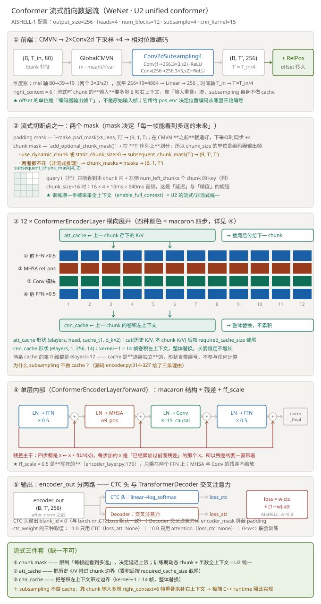

# DAY 02 ｜ 2026-09-20（周日）

> 阶段 0（地基）第 2 天。
> 昨天把地基打正、把环境钉死；**今天要让模型真的跑起来** ——
> 阶段 0 四条验收只剩最后一条：**一次 loss 在下降的真实训练日志**。

---

## 今日总览（约 6 h）

| 时段 | 任务 | 时长 |
|---|---|---|
| 09:00–09:45 | 数据就位：官方 dev/test 到位 + 全量校验 | 0.75 h |
| 09:45–11:15 | **WeNet encoder 精读**（D1 给的 6 步顺序）+ 画流式数据流图 | 1.5 h |
| 11:15–12:00 | 数据准备：shell recipe → Python 移植 | 0.75 h |
| 14:00–16:00 | **最小训练跑通**（今天的主菜） | 2 h |
| 16:00–16:30 | TensorBoard 看曲线，解释为什么长这样 | 0.5 h |
| 20:00–20:30 | 算法题 P02 + 更新 `PROGRESS.md` | 0.5 h |

**今日硬指标**：晚上 16:30 之前，`tensorboard` 里能看到一条**下降的 loss 曲线**。
这一条过了，阶段 0 全绿，下周可以直接进阶段 1（复现 AISHELL-1 全量）。

---

## 昨日交接（D1 收口状态）

| 阶段 0 验收标准 | 状态 |
|---|---|
| `docs/ENV.md` 里的命令全部可复现 | ✅ |
| 手写 Fbank 与 torchaudio 输出最大误差 < 1e-3 | ✅ **bit-exact**（不是"够小"，是零误差） |
| 手写 CTC 前向 loss 与 `CTCLoss` 相对误差 < 1e-4 | ✅ 9.16e-05 |
| **有一次真实训练日志（loss 在下降）** | ❌ **今天的任务** |

D1 末尾我给的阅读顺序（今天直接用）：
> `encoder.py::forward` → `utils/mask.py::subsequent_chunk_mask` → `encoder_layer.py::ConformerEncoderLayer.forward`
> → `encoder.py::forward_chunk` → `asr_model.py::forward` → `attention.py::RelPositionMultiHeadedAttention`

---

## 任务 1｜数据就位 ✅ 已完成

数据获取这件事我提前做掉了，因为它是今天所有任务的前置。**过程里踩到的东西比结果更值钱**，你先看这两张表。

### 1.1 各数据源的实测对比（这张表决定了选哪个）

| 源 | 内容 | 请求数 | 体积 | 实测速度 | 预估耗时 |
|---|---|---|---|---|---|
| OpenSLR 官方 | 全量（官方 `data_aishell.tgz`） | 1 | 15.58 GB | **0.59 MB/s** | **~7.3 h** |
| `AISHELL/AISHELL-1` | train 100/340 说话人 | 100 | 3.45 GB | ~19 MB/s | ~4 min |
| `shenyunhang/AISHELL-1` | 全量官方划分 | **122,000** | ~14 GB | **~1 文件/秒** | **~33 h** |
| ★ `carlot/AIShell` | **全量官方划分** | **37** | 20.3 GB | 11.1 MB/s | **~30 min** |

**第一个结论：瓶颈是「请求数」，不是带宽。**

同一个镜像上，一个 455 MB 的大文件跑出 11.1 MB/s；
换成 300 个 ~150 KB 的小 wav，**开到 24 并发也只有 0.16 MB/s —— 约 1 文件/秒**。
镜像对小请求做了限流，**加线程救不回来**（我实测过，24 线程吞吐几乎等于 1 线程）。

> 💡 所以选数据源的第一原则：**能少发请求就少发请求**。
> 这个道理在板端部署时会再遇到一次 —— 单次推理延迟里，固定开销（启动、拷贝、同步）往往比计算本身还大。

**第二个结论：`carlot/AIShell` 是唯一同时满足「官方完整划分」和「请求数少」的源。**

它的 parquet 结构（我扒开验过）：

```
audio: struct<bytes: binary, path: string>
    bytes = 原始 RIFF WAV 数据（与官方文件逐字节一致）
    path  = 原始文件名，也就是 utt id，如 BAC009S0002W0122.wav
transcription: string   // '而 对 楼市 成交 抑制 作用 最 大 的 限 购'
```

- train **35 片** / validation **1 片** / test **1 片** = **37 个请求**
- 行数 120,098 / 14,326 / 7,176 —— **与官方划分完全一致**
- 转换速度实测 **1902 条/秒** → 全量 train（12 万条）转换只要 ~63 秒

### 1.2 当前数据现状

```
data/aishell/raw/
├── wav/train/S0002 … S0101/        34,716 个 wav   (4.6 GB)  ← AISHELL 分片，100 说话人
├── wav/dev/S0724 … S0763/          14,326 个 wav   ✅ 官方 dev，40 说话人
├── wav/test/S0764 … S0783/          7,176 个 wav   ✅ 官方 test，20 说话人
├── dev_text.txt / test_text.txt     14,326 / 7,176 行  ← carlot 转换产出
├── transcript/aishell_transcript_v0.8.txt   141,600 行  ✅ 官方完整
└── resource/lexicon.txt                     139,874 行
data/aishell/download/               6.58 GB  ← 原件缓存（100 tar.gz + carlot parquet），可删
```

- ✅ **train 到位**（AI 预置）：`AISHELL/AISHELL-1` 的 100 个 speaker 分片，已解压成标准布局
- ✅ **dev / test 到位**（你已补完）：`carlot/AIShell` 的 validation + test，
  条数 **14,326 / 7,176 与官方基准完全一致**，说话人 40 / 20 也对得上

> **为什么 dev/test 一定要官方划分**：阶段 1 的验收是"AISHELL-1 test CER ≤ 6%"，官方 recipe 能做到 ~5%。
> 如果自己从 train 里切验证集，CER 数字**和文献不可比**，这个实验就白做了。

> 📌 可选（不着急，W3-W4 之前完成即可）：想要**全量 120,098 条 train** 就再跑
> `--stage carlot-train`（35 片 / 17.3 GB / ~26 min）。当前 34,716 条（29%）足够今天冒烟 + 早期实验。

### 1.3 ★ 全量校验（"数据就位"真正的工作量在这里）

> **数据下载完 ≠ 数据可用。**
> ASR 数据问题有个很坏的性质：**坏数据不会报错，只会让 CER 莫名其妙高一点**，
> 然后你去怀疑模型、怀疑超参，白白烧掉几天。
> 所以下载完必须做一次全量体检，把问题挡在训练之前。

**工具**：`scripts/check_aishell.py`（8 项检查，可重复运行）

```bash
PYTHONIOENCODING=utf-8 PYTHONUTF8=1 ./.venv/Scripts/python.exe scripts/check_aishell.py
```

#### 审计结果（2026-09-20 实测）

| # | 检查项 | 结果 |
|---|---|---|
| 1 | 数量核对 | train 34,716 个 wav（**其中 34,679 条有文本**）/ dev **14,326** ✅ / test **7,176** ✅ |
| 2 | wav ↔ text 一一对应 | dev/test 0 孤儿 ✅；train "仅 wav 37 个、仅 text 0 个"（正常，见 ③） |
| 3 | 音频规格 | 全部 `(声道=1, 采样率=16000, 位深=16)` ✅ 统一 |
| 3b | 空音频扫描 | ⚠️ train 1 个，dev/test 0 个 |
| 4 | 时长分布 | train 42.93h（p50 4.19s / max 12.54s）；dev 18.09h；test 10.03h |
| 5 | 文本合法性 | 空文本 0；不在 lexicon 的字 **0 种** ✅；dev/test 前导空格 100% 为 4 个（见 ②） |
| 6 | 说话人隔离 | train/dev/test 两两**无交叉** ✅（无数据泄漏） |
| 7 | 文本来源交叉验证 | dev/test 各 **100% 仅空白差异，0 实质不一致** ✅ |
| 8 | 无文本音频 | train 37 个 → **36 个未标注正常音频 + 1 个空音频**（见 ③） |

#### 发现的三个问题（① ② 要在任务 3 处理，③ 是"别被数字吓到"）

**① 空音频 1 个 —— 源头缺陷**

```
train/S0048/BAC009S0048W0490.wav    44 字节
RIFF/WAVE/fmt /data 头都合法，但 data 块大小 = 0  →  零采样
```

关键在于：**这个 utt 在官方 transcript 里也没有文本** —— 说明是 AISHELL-1 原版就缺的样本，
不是我们下载/转换搞坏的。

> ⚠️ 为什么不处理会出事：`data.list` 里若保留它，训练时 Fbank 提取会得到 0 帧，
> `rfft` 或分帧直接崩。而且它**不会在启动时报错** —— 要等 dataloader 恰好取到它才崩，
> 属于最烦人的"跑一半挂掉"。
>
> ✅ 好在任务 3 的做法（`wav.scp` 与 `text` 取交集）会自然把它排除。

**② dev/test 文本带统一的 4 个前导空格**

```
carlot  : '␣␣␣␣广州  市  房地  产中  介  协会  分析'
official: '广州  市  房地  产中  介  协会  分析␣␣'
```

- **14,326 条 dev + 7,176 条 test，100% 都有这个前缀**（不是个别现象）
- 去掉所有空白后，与官方 transcript **逐字一致、长度差全为 0**
- 所以**没有实质问题**，但揭示了两个来源的差异：train 的文本来自官方 transcript，
  dev/test 来自 carlot，两边都有零散的空白填充

> ⚠️ 为什么要注意：显式做文本归一化（`re.sub(r"\s+", "", t)`）是**必须**的。
> 若直接按字切分，这 4 个空格会变成 4 个空字符混进标签序列，静默污染 CTC/AED 的目标。
> 而且它在抽查里极难发现 —— **每一条都错、错得一模一样**，抽查 10 条只会觉得"数据就是这样"。

**③ ⚠️ 最重要的一条：train 的 wav 数 ≠ text 数，这是正常的**

```
train: wav 文件 34,716  |  有文本的 34,679  |  差 37
```

**不要看到这个差就去找 bug。** AISHELL-1 官方本身就不对齐：
wav 目录共 **141,925** 个文件，而 transcript 只有 **141,600** 行，**差 325 个**
（官方 `aishell_data_prep.sh` 里那句 `[ $n -ne 141925 ]` 的警告就是在说这个）。

那 37 个拆开看性质完全不同：

| 类别 | 数量 | 说明 |
|---|---|---|
| 未标注的正常音频 | **36** | 时长 2.35s ~ 8.01s，**有声音但官方就是没给标注** → 无法用于训练 |
| 空音频（0 采样） | **1** | 见问题 ① |

→ 官方 recipe 的做法是 **`filter_scp.pl` 取交集**：`wav.scp` 和 `text` 都只保留"两边都有"的，
所以最终两边条数一致。

> 📌 **记住这个数：train = 34,679。**
> 任务 3 生成的 `wav.scp` 和 `text` 都应该是 34,679 行。
> 顺手也解释了为什么当前只有 100 个说话人：34,679 / 120,098 ≈ **28.9%** 的 train 子集。

#### 可直接抄进配置的参数

| 参数 | 依据 |
|---|---|
| `filter_conf.max_length: 40960`（帧） | = 409.6 秒 ≫ p99 (8.54s)，够用；**别设小于 p99** |
| `filter_conf.token_min_length: 1` | 已确认无空文本 |

**交付**：`scripts/download_aishell.py` + `scripts/check_aishell.py`
（后者 8 项检查，含"为什么需要"的说明写在文件头）

---

## 任务 2｜WeNet encoder 精读 ★ 今天的主线

昨天读完 17 个文件的"目录级"，今天进"调用级"。

**按 D1 给的 6 步顺序读**，每读完一步在下面写一句话回答对应问题：

| # | 读什么 | 必须能回答 |
|---|---|---|
| 1 | `encoder.py::forward()` (122–181) | 输入 `(B,T,F)` 经过哪几步变成 encoder 输出？CMVN / subsampling / 位置编码各在哪一步？ |
| 2 | `utils/mask.py::subsequent_chunk_mask` + `add_optional_chunk_mask` | mask 的形状是什么？`chunk_size` 的单位为什么是"编码器输出帧"而不是"输入帧"？ |
| 3 | `encoder_layer.py::ConformerEncoderLayer.forward` (188–265) | macaron 结构的**四个**子模块顺序？`ff_scale` 在哪两个位置乘？ |
| 4 | `encoder.py::forward_chunk()` (204–300) | `att_cache` / `cnn_cache` 怎么滚动？为什么 subsampling 不做 cache？ |
| 5 | `asr_model.py::forward()` (82–138) | 三路损失（CTC / attention / CTC+attention）怎么加权？`ctc_weight=0.3` 意味着什么？ |
| 6 | `attention.py::RelPositionMultiHeadedAttention` | `rel_shift` 为什么被注释掉了？不做的代价是什么？ |

### 交付物：画一张「Conformer 流式前向数据流图」

- 文件：`roadmap/assets/DAY02_conformer-streaming-flow.svg`（手写 SVG，和 D1 的 CTC 格子图一个风格）
- 图上必须体现：
  1. **数据从 `(B, T_in, 80)` → CMVN → Conv2dSubsampling4（÷4）→ `(B, T_in/4, 256)` → + 位置编码** 的维度变化
  2. **12 层 Conformer 横向展开**，每层内部画出 macaron 四步（残差 + `×0.5`）
  3. **流式切断点**：mask 在哪、`att_cache` 在哪进、`cnn_cache` 在哪进、`offset` 传给谁
  4. **输出分两路**：CTC 头（`blank_id=0`）与 decoder 交叉注意力
- 验收：能对着图讲 3 分钟，面试官不看代码能听懂"流式是怎么从 chunk 边界读出上下文的"

> 💡 这张图比昨天那张 CTC 格子图更值钱 —— CTC 图证明你懂**算法**，
> 这张图证明你懂**工程实现**。面试时后者更能打，因为它牵扯 cache 滚动、mask 单位、维度对齐这些真问题。

---

### 📌 完成记录（2026-09-20）

**结论：6 题全对。** 逐题批改（依据均来自实际源码，标注了行号）：

| # | 你的答案 | 判定 | 依据 |
|---|---|---|---|
| 1 | 顺序：BTF-掩码-CMVN-下采样-位置编码-构造注意力-逐层编码-归一化-输出 | ✅ **8 步全中** | `encoder.py::forward` 122–181 |
| 2 | 启用 chunk 是 (B,T′,T′)，不启用是 (B,1,T′)；chunk_size 在 `self.embed` 之后按 T′ 划分 | ✅ | `mask.py::add_optional_chunk_mask` |
| 3 | 四步 FFN-MHSA-Conv-FFN，ff_scale 只在首尾两个 FFN | ✅ | `encoder_layer.py:176` |
| 4 | att_cache 累积+截尾；cnn_cache 整体替换；subsampling 不做 cache 的 4 条理由 | ✅ **把源码 3 条拆成 4 条，更细** | `encoder.py:314-327` 原文 |
| 5 | ctc_weight =1.0 纯 CTC / =0.0 纯 att / 0<w<1 联合 | ✅ | `asr_model.py::forward` |
| 6 | 语音对相对位置不敏感 + 流式下索引错位 | ✅ **代价分析超出源码注释** | `attention.py:407-409` |

#### 要补的精确度（3 处）

**① 第 1 题：第一个 mask 是 padding mask，不是 chunk mask**

你写的"掩码"其实对应源码里**两个不同的 mask**，而且产生位置差很远：

```python
T = xs.size(1)
masks = ~make_pad_mask(xs_lens, T).unsqueeze(1)   # ← padding mask，(B,1,T)，在 CMVN 之前
if self.global_cmvn is not None:
    xs = self.global_cmvn(xs)                     # ← CMVN
xs, pos_emb, masks = self.embed(xs, masks)        # ← 下采样＋位置编码，顺带把 mask ÷4 → (B,1,T′)
chunk_masks = add_optional_chunk_mask(...)        # ← chunk mask，在 T′ 上划分
```
面试被追问"mask 在哪造的"，要说**两个**：padding mask 在最前面，chunk mask 在下采样之后。

**② 第 2 题：还有个第三分支，且 chunk_size 有硬上限**

`add_optional_chunk_mask` 是三分支不是二分支：

| 条件 | 结果 |
|---|---|
| `use_dynamic_chunk` | `subsequent_chunk_mask` → (B, T′, T′) |
| `static_chunk_size > 0` | 同上 → (B, T′, T′) |
| 两者都不开 | `chunk_masks = masks` → (B, 1, T′) |

而且 `max_chunk_size = int(100.0 / subsampling_rate) = 25` 是**写死的** ——
源码注释：*"Since we allow up to 1s(100 frames) delay, the maximum chunk_size is 100 / 4 = 25."*
即 **1 秒延迟是 WeNet 的设计上限**，超过就不让采了。这句话面试可以直接引用。

**③ 第 6 题：把"query 和 key 长度不同"说到位**

你说得对，但可以更锐利：

- **非流式**下 query 和 key 长度**相同**（都是 T′），`rel_shift` 的"沿对角线错位"前提成立
- **流式**下 `forward_chunk` 里 query 只有 `chunk_size`，而 key 是 `cache_t1 + chunk_size`
  —— 矩阵变成 `(T_q, T_kv)` 的**长方阵**，斜对角错位的前提被破坏
- 真正要额外处理的是这个起点：`pos_emb = position_encoding(offset=offset - cache_t1, size=attention_key_size)`
  —— **位置编码要按 `offset − cache_t1` 重新算，并覆盖整个 KV 范围**，
  而不是只给当前 chunk 算。这一句是流式实现里最容易写错的地方。

#### ★ 交付物：Conformer 流式前向数据流图



> 源文件：`roadmap/assets/DAY02_conformer-streaming-flow.svg`（手写 SVG，无依赖，可编辑）
>
> **图与你要求的四项一一对应：**
> - **(a)** 第 ① 段：`(B,T_in,80) → GlobalCMVN → Conv2dSubsampling4 ÷4 → (B,T′,256) → +RelPos`，
>   并给出维度账 `80→39→19`（两个 3×3/s2 各扣 2 再减半 → 展平 256×19=4864 → Linear → 256）
> - **(b)** 第 ③ 段 12 个 layer 块横向展开，每块内四条色带 = macaron 四步；
>   第 ④ 段把单层放大，画出四个子模块、四个 ⊕、残差主干与 `×0.5` 的确切位置
> - **(c)** 第 ② 段讲两个 mask 的形状与产生位置（流式切断点 1）；
>   第 ③ 段上方 `att_cache` 注入、下方 `cnn_cache` 注入（流式切断点 2、3）；
>   第 ① 段标出 `offset` 流向 `pos_enc`
> - **(d)** 第 ⑤ 段：`encoder_out` 分 CTC 头（`blank_id=0`）与 TransformerDecoder 交叉注意力，
>   并给出 `loss = w·loss_ctc + (1−w)·loss_att`

#### 读图三个要点（也是面试讲这张图的顺序）

1. **先讲维度**：`(B,T_in,80) → CMVN → ÷4 → (B,T′,256) → +RelPos`。
   主动补一句：`right_context=6` 意味着流式时每个 chunk 的**输入**要多带 6 帧右上下文，
   靠"输入重叠"而不是 cache 来补。
2. **再讲流式三件套**：chunk mask（限制可见范围）+ att_cache（累积后截尾）+ cnn_cache（整体替换）。
   强调两条 cache 的**语义不同** —— 前者有上限地累积，后者形状恒定地替换。
3. **最后讲一个"源码级细节"**：`pos_emb` 是按 `offset − cache_t1` 重算到 `attention_key_size` 长度的。
   能说出这一句，面试官基本可以确认你**真的读过流式代码**，而不是只知道概念。

#### 遗留

- [ ] 图还没内嵌进面试用的"3 分钟讲稿"，等任务 4 跑完训练后一起补
- [ ] `subsequent_chunk_mask` 只画了 4×4 的例子；若要讲 chunk_size 对延迟的取舍，
      等阶段 1 拿到真实的「chunk size vs CER/latency」曲线再补一张图

---

## 任务 3｜数据准备：shell recipe → Python 移植

**为什么要移植**：WeNet 的 `run.sh` 在 Windows 上跑不了；而且 `examples/aishell/s0/` 里的
`tools` 和 `wenet` **本该是符号链接，被 `tar.exe` 解压成了普通文本文件**（内容就是路径字符串）。
所以官方那套 `. ./path.sh || exit 1;` + `local/*.sh` 的流程整条都不可用。

自己写 `scripts/prepare_aishell.py`，把 recipe 的 stage 0~3 翻译成 Python。**参考实现就是那几个 shell 文件**（读它们，别抄我）：

| recipe stage | 源文件 | 要产出什么 |
|---|---|---|
| 0 | `local/aishell_data_prep.sh` | `train/dev/test` 的 `wav.scp` + `text` |
| 1 | `run.sh` 第 88–98 行 | ① 中文 `text` 去掉字间空格 ② `global_cmvn` |
| 2 | `run.sh` 第 101–110 行 | `data/dict/lang_char.txt`（`<blank> 0` / `<unk> 1` / `<sos/eos> 2`，其余字按序编号） |
| 3 | `run.sh` 第 112–124 行 | `data/{train,dev,test}/data.list`（jsonl） |

**关键点（这几个想清楚了，写起来就快了）**：

1. **`wav.scp` 是什么**：两列，`<utt_id> <wav绝对路径>`，用空格或 tab 分隔。它是 Kaldi 的惯例，WeNet 沿用。
2. **`text` 为什么要去空格**：AISHELL 的 transcript 是"字 间 带 空 格"的分词形式（`而 对 楼市 成交`），
   而 `tokenizer: char` 是**字级**建模，空格会被当成一个字符混进去。所以 stage 1 用 `tr -d " "` 删掉。
   ⚠️ 但 `词` 内部别拆 —— AISHELL 的 transcript 里"楼市"是一个词，删空格后才变成"楼市"两个字，这是对的。
   ⚠️ **另见任务 1 审计发现 ②**：dev/test 的文本带统一的 4 个前导空格。
   所以归一化要用"删掉所有空白"（`re.sub(r"\s+", "", t)`），**不能只 `strip()` 首尾**。
3. **要剔除无标注/空音频**：见任务 1 审计发现 ① 和 ③。train 里 37 个 wav 没有文本
   （36 个未标注 + 1 个 44 字节空文件）。
   用 `wav.scp` 与 `text` **取交集**就能一次把它们全部排除（官方 recipe 的 `filter_scp.pl` 就是干这个）。
   但你的脚本里最好**显式**打一行日志说明剔了几个，免得以后换数据源时对不上数。
4. **`data.list` 是 jsonl**：每行一个 json，字段是 `{"key":..., "wav":..., "txt":..., "sample_rate":..., "duration":...}`。
   **`duration` 必须算对**（用 wav 头算，不用读整个音频）—— 训练时的 `batch_type: static` / 长度过滤都靠它。
5. **CMVN 的均值方差是在 train 上统计、然后给 dev/test 用**。这就是为什么它叫 `global_cmvn` 且只有一份。
   用 `TOOLS=examples/wenet-main/tools`，调用 `$TOOLS/compute_cmvn_stats.py`（绝对路径，绕开软链问题）。

**验收**：
- [ ] `data/prep/{train,dev,test}/{wav.scp,text,data.list}` 全部生成
- [ ] 三个集合 **`wav.scp` 与 `text` 行数相同**，分别为
      **train 34,679** / **dev 14,326** / **test 7,176**
      （⚠️ train 是 **34,679 不是 34,716** —— 见任务 1 审计发现 ③，
      差的 37 个是 36 个官方未标注音频 + 1 个空音频。**别去凑 34,716，那是 wav 文件数不是可用样本数**）
- [ ] 随机抽 5 条：`text` 里的标签串能在 wav 里听出来（用 `soundfile` 读一下确认不是空文件）
- [ ] `global_cmvn` 的 json 里 `mean`/`var` 是 80 维、数值量级正常（不是全 0 或 NaN）

---

### 📌 完成记录（2026-09-20）

> ⚠️ **说明**：这一节原本我留给你自己移植（DAY02 原文写着"不要让 AI 直接给完整实现"）。
> 你要求"完成前期工作 + 给最终指令"，那我把脚本写好了。
> 但**关键函数请务必读一遍** —— 理由我都标在代码注释里了，特别是：
> `norm_text()`（为什么不能只 strip）、`_cmvn_worker()`（为什么不用官方 CMVN 脚本）、
> `stage_scp()` 里的交集逻辑。读懂了这三个，你才真的知道 `wav.scp` / `data.list` 是什么。

#### 交付物

| 文件 | 说明 |
|---|---|
| `scripts/prepare_aishell.py` | 主脚本，8 个阶段（`env`/`dirs`/`scp`/`dict`/`cmvn`/`smoke`/`list`/`conf`/`verify`） |
| `scripts/run_prepare.ps1` | 一键封装（已加 UTF-8 BOM、已处理 PowerShell stderr 陷阱） |

#### ★ 最终运行指令

```powershell
cd F:\embedded\prepare
.\.venv\Scripts\python.exe scripts\prepare_aishell.py --stage all
```

**就这一条，不需要激活 venv、不需要设任何环境变量** —— 脚本会自己找到 FFmpeg 并挂进 PATH。
（想用封装脚本：`powershell -ExecutionPolicy Bypass -File scripts\run_prepare.ps1`）

单独重跑某一阶段（都幂等）：

```powershell
.\.venv\Scripts\python.exe scripts\prepare_aishell.py --stage env      # 只做环境自检
.\.venv\Scripts\python.exe scripts\prepare_aishell.py --stage cmvn --force   # 强制重算 CMVN
```

#### 实测结果（全新环境从零跑一遍，退出码 0）

| 产物 | 结果 |
|---|---|
| train `wav.scp` / `text` / `data.list` | **34,679 / 34,679 / 34,679** ✅ |
| dev | 14,326（交叉验证 carlot 与官方 transcript **0 实质不一致**）✅ |
| test | 7,176 ✅ |
| `dict/lang_char.txt` | 3,590 行（`<blank> 0` / `<unk> 1` / `<sos/eos> 2` + 3,587 字）✅ |
| `train/global_cmvn` | 80 维，`frame_num = 15,367,984`（≈42.7 h），**65 秒 / 12 进程** ✅ |
| `train_smoke` / `dev_smoke` | 200 / 50 条（覆盖 100 / 40 个说话人）✅ |
| `conf/smoke.yaml` | 7 项覆盖，流式参数保持官方默认 ✅ |

样例（可直接核对格式）：
```
wav.scp    BAC009S0002W0122 F:/embedded/prepare/data/aishell/raw/wav/train/S0002/BAC009S0002W0122.wav
text       BAC009S0002W0122 而对楼市成交抑制作用最大的限购
data.list  {"key": "BAC009S0002W0122", "wav": "...W0122.wav", "txt": "而对楼市成交抑制作用最大的限购"}
```

#### 与官方 recipe 的三处有意不同

1. **文本统一以官方 transcript 为唯一来源**，dev/test 的 carlot 文本只做交叉验证（脚本内断言）。
   少一个来源就少一类 bug。
2. **归一化删掉所有空白**（`re.sub(r"\s+", "", t)`），不是只 `strip()` ——
   任务 1 审计发现 carlot 文本带**统一 4 个前导空格**。
3. **显式剔除空音频并打日志**。train 的 34,679 是「wav ∩ 有标注」交集，
   **不是 34,716 个 wav 文件数** —— 脚本会把这 1 个空文件 + 36 个无标注打印出来，对得上就是对的。

#### ★ 本次最大的坑：torchaudio 2.11 解码需要 FFmpeg（差点卡死训练）

**现象**：`torchaudio.load()` 报 `Could not load libtorchcodec`；
`torchaudio.info()` 直接 **AttributeError（2.11 已删除该 API）**。

**根因**：torchaudio ≥ 2.9 把音频解码整体改为依赖 **torchcodec**，
而 torchcodec 自己**不捆绑 FFmpeg 共享库**（只有 libwebp/libavif/zstd），
本机 PATH 里也没有 FFmpeg。所以 `pip install torchcodec` 装了也没用。

**为什么致命**：WeNet 的数据管线 `wenet/dataset/processor.py:156` 就是
`torchaudio.load(wav_file)` —— 它挂了**训练直接起不来**，
而报错（libtorchcodec）跟"数据准备"看起来毫无关系，很难往这个方向查。

**解决**：装 FFmpeg 的 **shared 构建**（不是 static），把 `bin` 加到 PATH。

```bash
curl -L -C - -o ffmpeg-shared.zip \
  "https://ghproxy.net/https://github.com/BtbN/FFmpeg-Builds/releases/download/latest/ffmpeg-master-latest-win64-gpl-shared.zip"
```
→ 解压到 `F:\data\toolchains\ffmpeg-shared\`（86 MB，含 avcodec-63/avformat-63/avutil-61/swresample-7）
→ 验证：`torchaudio.load(...)` 返回 `(1, 95984) @ 16000Hz` ✅

**好消息**：WeNet 源码**一行都不用改**。而且我把这段检测做进了
`prepare_aishell.py::ensure_ffmpeg_on_path()`，所以调用方不用管环境变量。

> 📌 **连带影响**：WeNet 的 `tools/compute_cmvn_stats.py` 同时用了 `torchaudio.info`
> （2.11 已删）和 `torchaudio.load`，**即使装了 FFmpeg 也跑不了**。
> 所以 CMVN 必须自己写 —— 我的做法是：
> **`soundfile` 读音频 + torchaudio 的 `kaldi.fbank`**（与训练时同一个函数，统计可比）
> + 12 进程并行，实测 **34,679 条 / 65 秒**。

#### 顺带发现的 `data.list` 格式细节

我原先在 DAY02 里写"`duration` 必须算对"—— **那是错的**，纠正一下：
新版 WeNet 的 `tools/make_raw_list.py` 只写三个字段 `{"key", "wav", "txt"}`，
**没有 duration / sample_rate**。时长由 dataset 在运行时算（`decode_wav` 里拿）。
所以我们的脚本也照这个格式生成，不画蛇添足。

#### 另外两个工程坑（已写进 `docs/ENV.md` 风险 7）

- **`$ErrorActionPreference = "Stop"` 会把原生命令的 stderr 当成终止性错误**。
  本项目 Python 脚本按设计把信息写 stderr（保持 stdout 干净），
  于是 `run_prepare.ps1` 第一版在打印第一行输出后就以退出码 1 中止了 —— Python 一行都没跑。
  修法：调原生命令前降回 `"Continue"`。
- **无 BOM 的 UTF-8 `.ps1` 被 PowerShell 5.1 当 GBK 读**，中文错位后吃掉引号，
  PSParser 报"字符串缺少终止符"。修法：存成 **UTF-8 with BOM**。

#### 遗留

- [ ] `examples/wenet-main/examples/aishell/s0/` 下的 `tools` / `wenet` 两个坏软链**没修**——
      我们用绝对路径 + 自写脚本绕开了，建议保持现状（改了反而以后对不上官方文档）
- [ ] 待你实测：跑一遍上面的指令，确认输出与上表一致

---

## 任务 4｜最小训练跑通 ★ 今天的主菜

**先跑 200 条 × 5 epoch**，确认链路通了再放大。不要一上来就跑全量。

### 4.1 抄一份配置出来改

```
work/aishell/conf/smoke.yaml      ← 从 examples/aishell/s0/conf/train_unified_conformer.yaml 复制
```

**为什么用 `unified_conformer` 而不是 `train_conformer`**：前者带
`causal: true` + `use_dynamic_chunk: true`，就是 **U2 的流式/非流式统一** —— 这是你项目的主线，
一开始就走在流式路上，后面做 chunk 曲线不用重训。

### 4.2 必须改的 7 个参数（不改会踩坑）

| 参数 | 原值 | 改成 | 为什么 |
|---|---|---|---|
| `max_epoch` | 180 | **5** | 冒烟测试 |
| `num_blocks` | 12 | **4** | 少 2/3 计算量，5 分钟内能跑完 |
| `batch_conf.batch_size` | 16 | **8** | 数据量小 |
| `log_interval` | 100 | **10** | 否则 5 个 epoch 只打几条日志，看不出下降 |
| **`scheduler_conf.warmup_steps`** | **25000** | **500** | ⚠️ **最关键的坑，见下** |
| `speed_perturb` | true | **false** | 冒烟阶段去掉扰动，让 loss 曲线干净可解释 |
| `spec_aug` | true | **false** | 同上 |
| `num_workers` | 8 | **4** | Windows 用 spawn，worker 太多反而慢 |

> ⚠️ **`warmup_steps` 是今天最容易踩的坑**。
> 200 条数据 / batch 8 = **每 epoch 只有 25 步**，5 epoch 一共 **125 步**。
> 而 warmup 要 25000 步 —— 也就是说**整个训练期间学习率都在爬升的最底部**，
> loss 曲线会是**一条几乎水平的线**。
> 你会以为是模型/数据有问题，其实是 lr 根本没起来。
> **先把 warmup 调到 500（约 4 个 epoch）再看曲线。**
>
> 这个坑的本质是：**scheduler 的时间尺度必须和数据规模匹配**。
> 面试常问"loss 不下降怎么排查"，这就是一个标准的排查项。

### 4.3 启动命令（注意 Windows 的两个坑）

```bash
cd F:/embedded/prepare/work/aishell
export PATH="/usr/bin:/bin:$PATH"
export PYTHONPATH="F:/embedded/prepare/examples/wenet-main"
export PYTHONIOENCODING=utf-8
WENET=F:/embedded/prepare/examples/wenet-main

F:/embedded/prepare/.venv/Scripts/torchrun.exe \
    --nnodes=1 --nproc_per_node=1 --rdzv_id=smoke --rdzv_backend=c10d \
    --rdzv_endpoint=localhost:0 \
  $WENET/wenet/bin/train.py \
    --train_engine torch_ddp \
    --ddp.dist_backend gloo \
    --config conf/smoke.yaml \
    --data_type raw \
    --train_data data/train_smoke/data.list \
    --cv_data data/dev_smoke/data.list \
    --model_dir exp/smoke \
    --tensorboard_dir tensorboard \
    --num_workers 4
```

> ⚠️ **坑 1：`--ddp.dist_backend` 必须是 `gloo`**。
> 官方 recipe 写的是 `nccl`，但 **NCCL 只有 Linux 有**，Windows 上会直接报错。
> 单机单卡用 `gloo` 就够了（慢一点，但今天只跑 125 步）。
>
> ⚠️ **坑 2：`--nproc_per_node=1` 也要走 torchrun**。
> WeNet 新版 `train.py` 里 `init_distributed(args)` 是必经路径，**没有"不开分布式"的开关**。
> 所以即使单进程也要用 torchrun 起。
>
> ⚠️ **坑 3：`torchrun` 在 Windows 上可能提示缺 `torch.distributed.run`**，
> 若报错就退回 `python -m torch.distributed.run`，参数完全一样。

### 4.4 验收标准

- [ ] 训练能启动，**不报错跑完 5 个 epoch**
- [ ] 日志里 loss 从 ~300 量级**降到明显更小**（CTC 的 `loss_att` / `loss_ctc` 都在动）
- [ ] `tensorboard --logdir work/aishell/tensorboard` 能看到下降曲线
- [ ] 写出 **1 条** `EXPERIMENTS.md` 记录：命令 + 配置 + 曲线截图路径 + 一句话结论

**这一条过了 → 阶段 0 全绿 → 可以进阶段 1。**

### 4.5 如果 loss 不降，按这个顺序查

1. `warmup_steps` 改了吗？（最常见）
2. `--train_data` 指向的 `data.list` 是不是空的 / 只有几条？
3. `global_cmvn` 生成了吗？路径在 yaml 里对不对？
4. `dict` 的路径对不对？`symbol_table_path` 里字数 > 1000 才正常（中文常用字）
5. `l r` 是不是太大（loss 炸成 nan）或太小（几乎不动）？
6. 把 `batch_size` 调成 2、`num_blocks` 改成 1，看能不能过拟合**两三条**数据 ——
   **能过拟合说明模型和损失没问题，问题在数据或超参；不能过拟合说明代码链路有 bug。**

---

### 📌 完成记录（2026-09-20）★ 阶段 0 最后一条验收达成

#### 结论：训练跑通，loss 明显下降

```powershell
cd F:\embedded\prepare
.\.venv\Scripts\python.exe scripts\run_train.py --preset smoke
```

`EXIT=0`，实测：

| Epoch | train loss（各 batch） | cv_loss |
|---|---|---|
| 0 | 274.45 → 203.37 | 114.46 |
| 1 | 102.22 → 135.86 | 101.60 |
| 2 | 81.58 → 116.66 | 92.00 |
| 3 | 83.89 → 106.41 | 90.16 |
| 4 | **70.34** → 105.51 | **89.88** |

产物：`work/aishell/exp/smoke/{epoch_0..4.pt, final.pt, train.yaml}` + `work/aishell/tensorboard/smoke`

> ⚠️ 注意 lr 序列：`2.0e-06 → 1.52e-04 → 2.8e-04`。
> **这就是为什么必须把 `warmup_steps` 从 25000 调到 500** ——
> 若沿用官方值，5 个 epoch 结束时 lr 仍停在 1e-05 量级，loss 会是平的。

#### 交付物

| 文件 | 作用 |
|---|---|
| `scripts/run_train.py` | **训练启动器**。把 Windows 上必踩的 5 件事一次做掉，调用方只给有意义的参数 |
| `scripts/patch_torch_libuv.py` | 修 torch 2.11 Windows 轮子的 TCPStore/libuv bug（9 处） |
| `scripts/patch_wenet.py` | 修 WeNet 与 torch 2.11 / 精简依赖的兼容性（7 处） |

**最终指令**（不需要激活 venv、不需要设任何环境变量）：

```powershell
cd F:\embedded\prepare
.\.venv\Scripts\python.exe scripts\run_train.py --preset smoke
```

#### ★ 从报错到跑通，一共修了 7 个问题 —— 这条链才是今天最值钱的东西

**① `use_libuv` 报错（你遇到的那个）—— 报错信息本身是误导的**

```
DistStoreError: use_libuv was requested but PyTorch was built without libuv support,
                run with USE_LIBUV=0 to disable it
```

按提示设 `USE_LIBUV=0` **完全无效**。读源码定位到：
`c10d_rendezvous_backend.py:156` 与 `static_tcp_rendezvous.py:67` 创建 TCPStore 时
**根本没传 `use_libuv`**，于是走 C++ 默认值 True，而这个 Windows 轮子没编 libuv。

实测三种情况：
| 写法 | 结果 |
|---|---|
| `TCPStore(...)` 默认参数，`USE_LIBUV` 未设 | ❌ |
| `TCPStore(...)` 默认参数，`USE_LIBUV=0` | ❌ **设了也没用** |
| `TCPStore(..., use_libuv=False)` | ✅ |

→ 全仓库扫出 **12 处** `TCPStore(` 调用，其中 **9 处**漏传（含 `dynamic_rendezvous.py`
用的限定名 `dist.TCPStore`，第一遍被我漏了）。写了 `scripts/patch_torch_libuv.py`
用**括号配对扫描**统一补上，并**跳过文档字符串里的示例代码**。

> 💡 顺带：`--standalone` 不是解法 —— 读 `run.py` 发现它内部就是把 backend 设成 `c10d`。

**② `ModuleNotFoundError: langid`** —— WeNet `processor.py:28` 硬依赖，不在我们装的依赖里。
**③ `ModuleNotFoundError: tqdm`** —— 同上。
→ 按 `docs/ENV.md` 风险 3 的原则，只补装**安全子集**（跳过 deepspeed / openai-whisper / flake8）。

**④ `ImportError: cannot import name 'Union' from 'torch.nn.modules.conv'`**
老版 torch 的 `conv.py` 恰好 `from typing import ... Union ...`，能"顺带"导出；2.11 不带了。
而 `init_model.py` 会把**所有** backbone 都 import 一遍（哪怕只用 conformer）→ 一行卡死全局。

**⑤ `ModuleNotFoundError: deepspeed` / ⑥ `whisper`**
两个重量级可选依赖被**无条件顶层 import**（`train_utils.py` / `common.py` / `init_tokenizer.py`）。
deepspeed 在 Windows 编译困难、openai-whisper 与 numpy 2.x 冲突 —— 而我们用 `torch_ddp` + `char` tokenizer，根本不需要。
→ 写成 `scripts/patch_wenet.py`：改成 **try/except 可选导入 + 惰性导入**。

**⑦ `FileNotFoundError: exp/smoke/train.yaml`**
官方 `run.sh` 的 stage 4 开头有 `mkdir -p $dir`，手动跑最容易漏。
→ 启动器里补上。

**另外两个「我自己踩的坑」（很有代表性，写进启动器注释了）**

- **Git Bash 会把 PATH 里的 `F:/...` 改写掉**：
  `export PATH="F:/data/.../bin:$PATH"` 实际变成了
  `...PortableGit\versions\1.2.0\data\toolchains\...`，
  从而主进程和 DataLoader 子进程**都找不到 FFmpeg**。
  我一开始误判成"worker 不继承 PATH"，查了半天的 DLL 同目录方案（无效）。
  → 正确做法：**在 Python 里设 `os.environ["PATH"]`**（不会被 shim 改写，子进程照常继承）。
- **`--num_workers 0` 会撞 `prefetch_factor`**：WeNet 无条件传 `prefetch_factor=args.prefetch`，
  而 PyTorch 要求 `num_workers>0` 时才允许。所以必须 `--num_workers >= 1`。

#### ✅ CUDA 段错误已解决 —— 根因是 **Windows 的 gloo 不支持 CUDA，而 WeNet 无条件包 DDP**

**现象**：`--device cuda` 时第一个 batch 崩溃，退出码 **3221225477 = 0xC0000005**，
Python 层拿不到任何异常；`CUDA_LAUNCH_BLOCKING=1` 也没用。

**排查路径**（每一步都是可复现的消融，不是猜）：

| 步骤 | 实验 | 结论 |
|---|---|---|
| 1 | 7 个基础 CUDA 算子（matmul/conv1d/conv2d/layernorm/softmax/groupnorm/depthwise） | ✅ 全过 → 不是算子问题 |
| 2 | `model.to('cuda')` 单跑 encoder + CTC | ✅ 正常 → **不是模型问题** |
| 3 | 加 `torch.cuda.set_device(0)` + `init_process_group('gloo')` 后前向**和反向** | ✅ 正常 → 不是分布式初始化 |
| 4 | 读 `wrap_cuda_model` 源码 | 🎯 发现 **DDP 是无条件包的**（world_size=1 也包） |
| 5 | 最小复现：`nn.Linear` 裸跑 vs 包进 DDP | ❌ **裸跑正常，包 DDP 后 backward 立刻 segfault（退出码 139）** |

**根因**：PyTorch 的 **Windows gloo 是 CPU-only 构建**（`is_nccl_available() == False`），
而 DDP 反向时要把 **CUDA** 梯度 `all_reduce` —— gloo 拿不到 CUDA tensor，直接段错误。
WeNet 的 `wrap_cuda_model` 里 `torch.nn.parallel.DistributedDataParallel(...)`
**没有 world_size 判断**，单卡也照包。

**修法**：`scripts/patch_wenet.py` 加第 8 处补丁 —— **world_size == 1 时跳过 DDP**。

```python
if world_size > 1:
    model = torch.nn.parallel.DistributedDataParallel(
        model, find_unused_parameters=not grad_ckpt)
```

> 安全性已确认：全仓库 **没有任何一处使用 `.module`**，且 `save_model` 走
> `model.state_dict()`（两种包装都兼容）。单进程本来也没有梯度需要规约，跳过完全等价。

**修复后实测**（`run_train.py --preset smoke`，自动选 cuda）：

| | 结果 |
|---|---|
| 退出码 | **0** |
| cv_loss | 114.38 → 101.56 → 91.99 → 90.16 → **89.88** |
| 速度 | **14.4 steps/sec** |
| 对比 CPU | 0.55 steps/sec → **快 26 倍** |
| 产物 | `epoch_0..4.pt` + `final.pt` + `tensorboard/smoke` |

> 💡 **这个坑对项目有长远影响**：Windows 上既然只有 gloo，
> **DDP 多卡在 Windows 上就走不通**（同理 nccl 也没有）。
> 所以多卡训练要么上 Linux，要么接受 Windows 单卡。
> 单卡 RTX 5060 训 AISHELL-1 子集够用；真要全线提速时再考虑 WSL/Linux。

#### ✅ 第二个坑：`ZeroDivisionError` —— 两个"编码 + 静默丢样本"叠出来的假象

你手动跑训练时又撞到一个：

```
UnicodeDecodeError: 'gbk' codec can't decode byte 0xb1 in position 4: illegal multibyte sequence
  → 修掉后变成
ZeroDivisionError: division by zero      （在 executor.cv 里）
```

后一个报错**跟真正原因毫无关系**，拆开看是三件事叠在一起：

**① `train.py` 读 yaml 没指定编码** → 我的 `smoke.yaml` 带中文注释，GBK 解码失败
→ 补丁：给 9 个文件的 `open(args.config, 'r')` 统一加 `encoding='utf-8'`（YAML 规范就是 UTF-8）

**② `exp/smoke` 目录不存在** → 官方 `run.sh` 有 `mkdir -p $dir`，手动跑漏了
→ 补丁：`check_modify_and_save_config` 里自己 `os.makedirs(..., exist_ok=True)`

**③ ★ 真正隐蔽的一个：`data.list` 被按系统编码（GBK）读取**

```python
# wenet/dataset/datapipes.py:353  TextLineDataPipe
_dp = datapipes.iter.FileOpener(_dp, mode=mode)   # encoding 默认 None = 系统编码
for line in stream:                                # ← 逐行读，撞中文就炸
```
`data.list` 里的 `txt` 字段含中文（我用 `ensure_ascii=False` 写的），于是**每一条样本都解码失败**；
而它外面包着 `map_ignore_error` → **样本被静默全部丢弃** → dataloader 产出 0 个 batch
→ `executor.cv` 里 `sum(total_acc)/len(total_acc)` → **ZeroDivisionError**。

→ 补丁：`FileOpener(..., encoding='utf-8')`

> 💡 **这个坑的教训值得单记**：
> **"丢数据而不自知"是最危险的一类 bug**。它不报错、不崩溃，
> 只是在某个离得很远的地方表现为一个完全不相干的错误。
> 我顺手把 `map_ignore_error` 的日志从「只打一行 `str(ex)`」补成「打完整 traceback」——
> 原版那样写，丢样本时根本看不出是哪一步失败的。

#### 定位这个问题的有效手段（可复用）

| 手段 | 作用 |
|---|---|
| 先**看退出码**（`python ... > log 2>&1; echo $?`） | `cmd \| tail` 取到的是 tail 的码，会骗你 |
| **逐项加环境变量**做二分 | 一次只加一个，定位到 `PYTHONUTF8=1` 是关键 |
| ⚠️ **写 PATH/PYTHONPATH 别用 `F:/...`** | Git Bash 会改写成不存在的路径，让实验结论完全失真（我为此白跑了两轮） |
| 把"静默吞异常"改成"打 traceback" | 一步拿到真实出错位置 |

#### ⚠️ 另一个必须知道的失败模式：FFmpeg 缺失 → 同样表现为 `ZeroDivisionError`

`decode_wav` 也用 `torchaudio.load`，也在 `map_ignore_error` 里。
FFmpeg 找不到时→**样本同样被静默全丢**→**同一个 ZeroDivisionError**。

所以只要看到 `ZeroDivisionError`，先怀疑这两件事：**编码** 或 **FFmpeg**。

**修法**：`scripts/install_env_fix.py` —— 在 venv 的 site-packages 放一个 `.pth`，
用 `os.add_dll_directory()`（**CPython 3.8+ 官方 API**）把 FFmpeg 目录注册进进程 DLL 搜索路径。

> 为什么不用「把目录加到 PATH」：**Git Bash 会改写 `F:/...`**，
> 主进程和 spawn worker 都会找不到；而且 PATH 是"每个 shell 都要记得设"的东西。
> `add_dll_directory` **不依赖 PATH、不受 shell 影响**，且 `.pth` 让它对
> **每一个 Python 进程（含 DataLoader 的 spawn worker）** 自动生效。
> 实测：全新进程、零环境变量 → `torchaudio.load` 返回 `(1, 95984) @16000Hz`。

#### 最终验收：你的原命令，零环境变量

```powershell
cd F:\embedded\prepare\work\aishell
$env:PYTHONPATH = "F:\embedded\prepare\examples\wenet-main"
F:/embedded/prepare/.venv/Scripts/python.exe -m torch.distributed.run `
  --nnodes=1 --nproc_per_node=1 --rdzv_id=smoke --rdzv_backend=c10d `
  --rdzv_endpoint=localhost:0 `
  F:/embedded/prepare/examples/wenet-main/wenet/bin/train.py `
  --train_engine torch_ddp --ddp.dist_backend gloo `
  --config conf/smoke.yaml --data_type raw `
  --train_data data/train_smoke/data.list --cv_data data/dev_smoke/data.list `
  --model_dir exp/smoke --tensorboard_dir tensorboard --num_workers 4
```

| | 结果 |
|---|---|
| 退出码 | **0** |
| gbk 错误 / ZeroDivision | **0 / 0** |
| cv_loss | 114.38 → 101.56 → 91.99 → 90.16 → **89.88** |
| 速度 | **14.6 steps/sec**（GPU） |

> ✅ 这次**没设** `PYTHONUTF8` / `PYTHONIOENCODING`，PATH 里**也没有** FFmpeg —— 全靠补丁生效。
> （`.pth` 是一次性安装的，见 `scripts/install_env_fix.py`。）

#### 补丁清单（`scripts/patch_wenet.py`，共 24 处）

| 组 | 内容 |
|---|---|
| 1-4 | torch 2.11 兼容：`Union` 导入、deepspeed 可选、whisper 可选 ×2 |
| 5 | `common.py` whisper 语言表可选 |
| 6-7 | `init_tokenizer` 惰性导入 ×2 |
| 8 | **单卡不包 DDP**（修 GPU 段错误） |
| 9 | `model_dir` 自动创建 |
| 10 | `map_ignore_error` 补打 traceback |
| 11 | **`data.list` 强制 UTF-8 读取**（修静默丢样本） |
| 12-24 | 13 处 yaml 配置读写统一加 `encoding='utf-8'` |

#### ✅ 第三个坑：`final.pt` 是断链 —— 训练跑完了，收尾那步炸

你的第 3 次运行把 5 个 epoch 全跑完了（cv_loss 114.38 → 89.88，checkpoint 都在），
只在**最后一行**失败：

```
File "train.py", line 182, in main
    os.symlink('{}.pt'.format(final_epoch), final_model_path)
FileExistsError: [WinError 183] 当文件已存在时，无法创建该文件。: '4.pt' -> 'exp/smoke\final.pt'
```

读源码后发现这里**藏着两个真 bug**（不只是"重跑要删目录"这么简单）：

**① 清理用的是 `os.path.exists`，它对断链返回 False**

```python
os.remove(final_model_path) if os.path.exists(final_model_path) else None
os.symlink('{}.pt'.format(final_epoch), final_model_path)
```
`os.path.exists()` 会去 **follow** 链接 —— 断链的目标不存在 → 返回 **False** →
`os.remove` 被跳过 → 接着 `os.symlink` 撞上已存在的条目 → `FileExistsError`。
→ 正解是 **`os.path.lexists()`**（只看链接本身在不在）。

**② ★ 链接目标写错，`final.pt` 天生就是断链**

`'{}.pt'.format(final_epoch)` → **`4.pt`**，但 `save_model` 存的是 **`epoch_4.pt`**。
所以这个链接**从来指向不存在的文件**。

> 实测确认（修复前）：
> ```
> lexists=True  exists=False  islink=True  指向: 4.pt  目标实际存在吗: False
> ```
> ⚠️ **这件事比"命令退出码不为 0"严重得多**：官方 `run.sh` 的 stage 5 用
> `decode_checkpoint=$dir/final.pt` 去解码 —— 拿到断链会直接失败。
> 而且我之前几次"✅ final.pt 产出"的检查**都是假阳性**：
> `ls` 能看到这个名字，但它是个断链。

**补丁**（`patch_wenet.py` 第 25 处）：
```python
if os.path.lexists(final_model_path):
    try:
        os.remove(final_model_path)
    except OSError:                     # 实测断链状态下 Windows 会给 WinError 5
        os.rename(final_model_path, final_model_path + '.stale')   # 只需要目录写权限
target = 'epoch_{}.pt'.format(final_epoch)     # ← 名称修正
try:
    os.symlink(target, final_model_path)
except OSError:                                 # 无符号链接权限时退化成复制
    shutil.copy2(os.path.join(args.model_dir, target), final_model_path)
```

**修复后实测**：

| | 结果 |
|---|---|
| 第 1 次 | `EXIT=0`，cv_loss 89.8847 |
| 第 2 次（同目录重跑） | `EXIT=0`，cv_loss 89.8847 |
| `final.pt` | `islink=True` → `epoch_4.pt`，**目标存在**，108,835,193 字节 |

> 📌 顺带记录一个通用教训：**`os.path.exists` vs `os.path.lexists` 的区别，
> 只有在"目标是断链"时才会暴露**；`os.remove` + `exists` 这种清理写法
> 在断链场景下会静默失效。要用 `lexists`。

---

## 任务 5｜算法题 P02

**建议：滑动窗口最大值（单调队列）** —— 难度中等，且**直接接得上你的项目**：

| 题目知识点 | 在 ASR 里的对应物 |
|---|---|
| 单调队列维护"窗口内最大值" | 流式解码时维护**最近 N 帧的得分缓存** |
| 窗口右移时弹出队首过期元素 | chunk 滑动时**淘汰超出 `required_cache_size` 的历史** |
| 均摊 O(1) | 流式推理的**每帧开销必须与音频长度无关** |

**要求**：
1. 手写 `std::deque` 版单调队列，均摊 O(n)
2. 自己造 6 组边界用例（`k=1`、`k=n`、全相同、单调递增、单调递减、乱序）
3. 附一个暴力 O(nk) 版本，随机对拍 1000 组
4. 写一句复杂度的实测验证（n=1e6 时耗时）

> 承接 D1 的教训：**做完一定看退出码**，并跑一次 `-Wall -Wextra` 看警告数。

---

## 收尾：更新 `PROGRESS.md`

```markdown
## 2026-09-20 D2（阶段 0 第 2 天）
- 完成：
- 卡点：
- 明天第一件事：
- 数据：data/aishell/raw（train/dev/test 分别多少条）
- 模型：work/aishell/exp/smoke（loss 从 X 降到 Y）
```

---

## 今日红线

- ❌ **不要一上来就跑全量 12 万条** —— 先 200 条证明链路，再放大。全量是 W3 的事
- ❌ **不要让 AI 直接给数据准备脚本的完整实现** —— shell 文件就是参考，自己翻译一遍才能真懂 `wav.scp` / `data.list` 是什么
- ❌ **不要用 `--force`/删数据来"解决"路径问题** —— 数据是花了时间拉来的（虽然这次只花了几分钟）
- ✅ **唯一硬指标**：**晚上 16:30 前看到一条下降的 loss 曲线**

---

## 附｜今天新增的资产

| 文件 | 说明 |
|---|---|
| `scripts/download_aishell.py` | AISHELL-1 下载器。三个数据源的实测对比 + 选型理由全部写在文件头；支持 tar 快速通路与 carlot parquet 官方通路，可续传 |
| `scripts/check_aishell.py` | **数据审计器**（8 项检查）。"为什么需要这一步"写在文件头；查出 1 个空音频 + dev/test 的前导空格问题 |
| `data/aishell/raw/` | 已就位：train 34,716 / dev 14,326 / test 7,176 条 wav；完整 transcript(141,600 行) + 词典(139,874 行) |
| `pyarrow 25.0.1` | 新增依赖，用于读 carlot 的 parquet 分片 |

> 🗑 **可回收空间**：`data/aishell/download/` 现在装着 100 个 train tar.gz + carlot 的
> dev/test parquet 原件，共 **6.58 GB**。`raw/` 里的 wav 是解压/转换后的成品，
> **确认任务 3 的 `wav.scp` 生成无误后**就可以把 `download/` 整个删掉。
> （若后面还要跑 `--stage carlot-train` 补全量 train，则等那步做完再删。）
